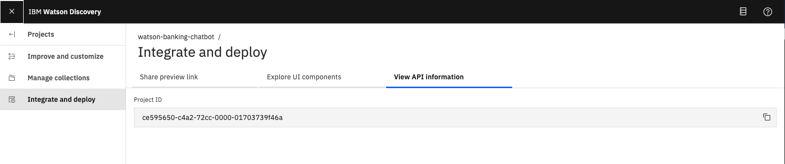
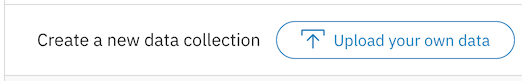
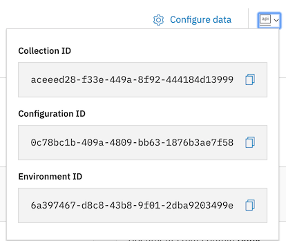

# Your virtual banking bot assistant.

I used Watson Assistant and Node.js to build a virtual banking assisting chatbot called AquaBank. The Assistant flow recognises the location entities and uses Natural Language Understanding to improve customer emotion detection. Calls to the Discovery service will employ passage retrieval to find solutions to frequently asked questions from a collection of documents.

After following this method, the reader will know how to:

1. Use  Watson Assistant and Node.js to build a chatbot that communicates over a web UI.

2. To find answers in FAQ documents, use passage retrieval and Watson Discovery.


3. Use Watson Natural Language Understanding, locate entities

   

## Included components

* [IBM Watson Assistant](https://www.ibm.com/cloud/watson-assistant/): Build, test and deploy a bot or virtual agent across mobile devices, messaging platforms, or even on a physical robot.
* [IBM Watson Discovery](https://www.ibm.com/watson/services/discovery/): A cognitive search and content analytics engine for applications to identify patterns, trends, and actionable insights.
* [IBM Watson Natural Language Understanding](https://www.ibm.com/watson/services/natural-language-understanding/): Analyze text to extract meta-data from content such as concepts, entities, keywords, categories, sentiment, emotion, relations, semantic roles, using natural language understanding.

## Featured technologies

* [Node.js](https://nodejs.org/): An asynchronous event driven JavaScript runtime, designed to build scalable applications.

## Steps

1. [Clone the repo](#1-clone-the-repo)
1. [Create Watson services](#2-create-watson-services)
1. [Customize the Watson Assistant skill](#3-customize-the-watson-assistant-skill)
1. [Load Discovery documents](#4-load-discovery-documents)
1. [Deploy the application](#5-deploy-the-application)
1. [Use the web app](#6-use-the-web-app)

### 1. Clone the repo

Clone the `watson-banking-chatbot` locally. In a terminal, run:

```bash
git clone https://github.com/Roohishaik/AquaBank.git
```

### 2. Create Watson services

Provision the following services:

* **Watson Assistant**
* **Watson Discovery**
* **Watson Natural Language Understanding**

The instructions will depend on whether you are provisioning services using IBM Cloud Pak for Data or on IBM Cloud.

Click to expand one:

<details><summary><b>IBM Cloud Pak for Data</b></summary>
<p>
<i>Use the following instructions for each of the three services.</i>
<p>
<h5>Install and provision service instances</h5>
<p>
The services are not available by default. An administrator must install them on the IBM Cloud Pak for Data platform, and you must be given access to the service. To determine whether the service is installed, Click the <b>Services</b> icon () and check whether the service is enabled.
</details>

<details><summary><b>IBM Cloud</b></summary>
<p>
<h5>Create the service instances</h5>
  <ul>
    <li>If you do not have an IBM Cloud account, register for a free trial account <a href="https://cloud.ibm.com/login">here</a>.</li>
    <li>Click <a href="https://cloud.ibm.com/catalog/services/watson-assistant">here</a> to create a <b>Watson Assistant</b> instance.</li>
    <li>Click <a href="https://cloud.ibm.com/catalog/services/discovery">here</a> to create a <b>Discovery</b> instance.</li>
    <li>Click <a href="https://cloud.ibm.com/catalog/services/natural-language-understanding">here</a> to create a <b>Natural Language Understanding</b> instance.</li>
  </ul>
</details>

### 3. Customize the Watson Assistant skill

The following instructions will depend on if you are provisioning Assistant from IBM Cloud or from an IBM Cloud Pak for Data cluster. Choose one:

<details><summary>Provision on IBM Cloud Pak for Data</summary>
<p>

* Find the Assistant service in your list of `Provisioned Instances` in your IBM Cloud Pak for Data Dashboard.
* Click on `View Details` from the options menu associated with your Assistant service.
* Click on `Open Watson Assistant`.
* Go to the `Skills` tab.
* Click `Create skill`
* Select the `Dialog skill` option and then click `Next`.
* Click the `Import skill` tab.
* Click `Choose JSON file`, go to your cloned repo dir, and `Open` the JSON file in `data/conversation/workspaces/banking_US.json` (or use the old full version in `full_banking.json`). `banking_IN.json` is used for content for banking in India and `banking_US.json` is used for content for banking in United States.
* Select `Everything` and click `Import`.

</p>
</details>

<details><summary>Provision on IBM Cloud</summary>
<p>

* Find the Assistant service in your IBM Cloud Dashboard.
* Click on the service and then click on `Launch tool`.
* Go to the `Skills` tab.
* Click `Create skill`.
* Select the `Dialog skill` option and then click `Next`.
* Click the `Import skill` tab.
* Click `Choose JSON file`, go to your cloned repo dir, and `Open` the JSON file in `data/conversation/workspaces/banking_US.json` (or use the old full version in `full_banking.json`). `banking_IN.json` is used for content for banking in India and `banking_US.json` is used for content for banking in United States.
* Select `Everything` and click `Import`.

</p>
</details>

To find the `Skill ID` for Watson Assistant:

* Go back to the `Skills` tab.
* Click on the three dots in the upper right-hand corner of a card and select `View API Details`.
* Copy the `Skill ID` GUID. Use this value when setting up your run-time environment.
* By default the application will import and use the skill named **watson-banking-chatbot**, but you can configure it to use another skill by setting the run-time environment variable `SKILL_ID`.

### 4. Load Discovery documents

By default, the application will create a collection named **watson-banking-chatbot**, but you can configure it to use another collection by setting the run-time environment variables `DISCOVERY_COLLECTION_ID` and `DISCOVERY_ENVIRONMENT_ID`.

The following instructions will depend on if you are provisioning Discovery from IBM Cloud or from an IBM Cloud Pak for Data cluster. Choose one:

<details><summary>Provision on IBM Cloud Pak for Data</summary>
<p>

* Find the Discovery service in your list of `Provisioned Instances` in your IBM Cloud Pak for Data Dashboard.
* Click on `View Details` from the options menu associated with your Discovery service.
* Click on `Open Watson Discovery`.
* Click on an existing Discovery `Project`, or create a new one.
* From your `Project` panel, click the `Collections` tab.
* Click on `New Collection +`.
* Select the `Upload data` option and click `Next`.
* Provide a collection name.
* Select `English` language.
* Click `Finish` to create the collection.
* Use `Drag and drop your documents here or select documents` to seed the content with the five documents in `data/discovery/docs` of your cloned repo.
* Click on the `Integrate and deploy` option from the left-side menu of the Discovery panel. Then select the `View API Details` tab to view the `Project Id`. Use this as the `Collection ID` value when setting up your run-time environment.

> **NOTE**: The `Environment Id` for Cloud Pak for Data collections is always set to `default`.

  

</p>
</details>

<details><summary>Provision on IBM Cloud</summary>
<p>

* Find the Discovery service in your IBM Cloud Dashboard.
* Click on the service and then click on `Launch tool`.
* Create a new data collection by hitting the `Upload your own data` button.

  
  * Provide a collection name
  * Select `English` language
  * Click `Create`

* Use `Drag and drop your documents here or select documents` to seed the content with the five documents in `data/discovery/docs` of your cloned repo.
* Click on the upper-right `api` icon and save the `Environment ID` and `Collection ID` as they will be required when setting up your run-time environment.

  

</p>
</details>

### 5. Deploy the application

Click on one of the options below for instructions on deploying the Node.js server.

| | | |
| :-: | :-: | :-: |
| [](doc/source/local.md) | [](doc/source/openshift.md) | [](doc/source/cf.md) |

### 6. Use the web app

The web app presents a customer service chatbot. Interact with the chatbot by pressing the buttons when prompted or use the `Type something` box. The chatbot is powered by Watson Assistant with additional information coming from Discovery and Natural Language Understanding.


https://github.com/Roohishaik/AquaBank/assets/94975857/a8b1ba16-d2a9-4e4c-8eed-678bcde7c4cd


